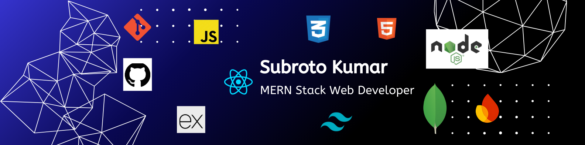

 
 

<h1 align="center">Hi 👋, I'm Subroto Kumar</h1>

MERN Stack Web Developer

---

I'm a MERN Stack Web Developer with working knowledge of React, Node.js, Express.js, and MongoDB.  
Currently, I'm learning Next.js and focusing on building modern web applications.  
My main interest is web development, and my career goal is to become a software engineer.

### 🚀 Current Activities
- 🌱 Learning **Next.js** to build modern, scalable web applications  
- 🛠️ Building and refining projects using React, Node.js, Express & MongoDB  
- 📂 Improving GitHub repositories, code quality, and best practices  
- 🔍 Actively seeking **Junior MERN Stack / Frontend Developer** opportunities  

## 🧠 Tools & Technologies

### 🖥️ Programming Languages

### ⚙️ Frameworks & Libraries

### 🎨 Frontend & Styling

### 🗄️ Databases

### 🧰 Tools & Platforms

### 🚀 Deployment

---

### 🔗 Connect with Me

    
    
    

---

<h3 align="left">Current Stack & Git Stats:</h3>

<!-- Top Languages / Current Stack -->
<!-- 

 -->

<!-- Total Commits / GitHub Stats -->
<!-- 
&nbsp;
 -->

<!-- Longest Streak -->

